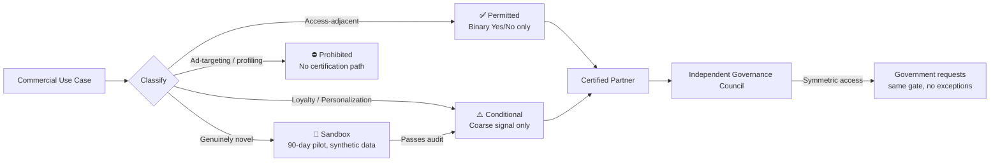
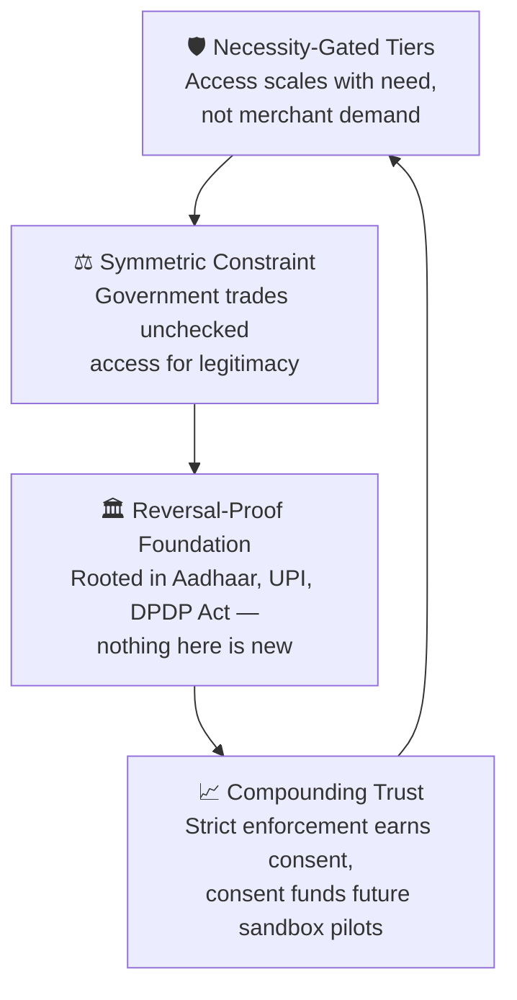

# 🛂 DigiYatra Trust Gate
### *Proof, Not Identity*

**A governance framework for DigiYatra's leap from airport identity to everyday commerce.**

`Track 3 — Governance & Ecosystem Management` · `IIMB National Student Case Challenge` · `Status: Submitted`

> **Team Exord** — Aditya Kumar · Arnav Malick · Hamdan Ansari · Divij Kukreja · Anshika Mishra

This repository is the **research trail** behind our submission — every precedent we studied, every inference we drew from it, and exactly where that inference shows up in the final framework. Nothing in our deck was asserted without a reason; this is where you can check that reasoning yourself.

---

## 📑 Table of Contents

- [The One-Line Thesis](#-the-one-line-thesis)
- [The Problem We're Solving](#-the-problem-were-solving)
- [The Framework at a Glance](#-the-framework-at-a-glance)
- [How the System Reinforces Itself](#-how-the-system-reinforces-itself)
- [Research Foundation — Precedents & Inferences](#-research-foundation--precedents--inferences)
- [Academic Papers We Reviewed](#-academic-papers-we-reviewed)
- [Design Decisions & Why We Made Them](#-design-decisions--why-we-made-them)
- [Known Limitations — Stated Openly](#-known-limitations--stated-openly)
- [Assumptions](#-assumptions)
- [Team & Acknowledgements](#-team--acknowledgements)

---

## 💡 The One-Line Thesis

> DigiYatra may expand into loyalty programmes, personalized services, and customer analytics **only through certified, purpose-bound proofs — never through raw personal data.** Every commercial partner receives a certified answer to the one question it's permitted to ask; nothing more.

We call this **Verification-as-a-Service**: a Yes/No for identity, a coarse signal for behaviour — never the underlying data itself.

---

## 🧭 The Problem We're Solving

DigiYatra today is a closed-loop, opt-in identity layer — biometric templates live on-device, verification data is purged within 24 hours. It has scaled to **19M+ registered users across 100+ airports**, processing **100M+ journeys**.

Companies now want to extend that trust into hotels, loyalty programmes, and personalization. The brief asks a specific question: **whether, and under what conditions**, that expansion should happen. Three gaps in how this is usually approached:

<table>
<tr><td width="33%" valign="top">

**🎯 One-size-fits-all data sharing**
Loyalty, personalization, and analytics all get treated as equally risky today — when they aren't.

</td><td width="33%" valign="top">

**🚪 No exit accountability**
If a partner company shuts down or is acquired, there's currently no rule forcing deletion of the data it held.

</td><td width="33%" valign="top">

**🔍 Government's own blind spot**
Oversight usually watches companies, not government itself — the same blind spot that triggered Aadhaar's 2018 reversal.

</td></tr>
</table>

---

## 🏗️ The Framework at a Glance

| Tier | Use Case | Data Shared | Consent | Approval Path |
|---|---|---|---|---|
| **Permitted** | Hotel / access-adjacent check-in | Yes/No only | Single opt-in | Standard certification |
| **Conditional** | Loyalty, personalization | Coarse signal only | Purpose-specific opt-in | Certification + bias audit |
| **Sandbox** | Genuinely novel use cases | Minimized / synthetic | Pre-disclosed | 90-day pilot |
| **Prohibited** | Ad-targeting, individual analytics | None | N/A — opt-out default | No path exists |

---

## 🔄 How the System Reinforces Itself

<b>Click to expand — the self-reinforcing loop</b>

The loop closes on itself: gated necessity → symmetric enforcement → proven foundation → compounding trust → which justifies extending the same necessity gate to the next use case. This is deliberate — a framework that *only* restricts doesn't scale; one that reinforces itself does.

---

## 📚 Research Foundation — Precedents & Inferences

Every mechanism in our framework maps to something that has **already happened** — a real success or a real failure. Click each one to see what we drew from it.

<b>🇮🇳 Aadhaar's Two-Mode Authentication (Yes/No vs. e-KYC)</b>

**What it is:** UIDAI operates two distinct disclosure modes — a binary Yes/No confirmation that shares zero personal data, and a richer e-KYC mode that shares name, address, DOB, and photo with consent.

**Inference drawn:** India already runs a proven, legally codified tiered-disclosure system at national scale. We didn't invent our Permitted/Conditional split — we extended a mechanism that already works.

**Where it shows up:** The Permitted tier (binary confirmation) and Conditional tier (limited data with consent) directly mirror this split.

<b>⚖️ Justice K.S. Puttaswamy (Retd.) v. Union of India (2017)</b>

**What it is:** A nine-judge Supreme Court bench unanimously held that privacy is a fundamental right under Article 21, arising from a direct challenge to the Aadhaar scheme. The judgment established a proportionality test that binds **state action** specifically, not just private actors.
📄 [Judgment via Wikipedia](https://en.wikipedia.org/wiki/Puttaswamy_v._Union_of_India) · [Full text (Supreme Court)](https://digiscr.sci.gov.in/admin/judgement_file/judgement_pdf/2017/volume%2010/Part%20I/justice%20k%20s%20putiaswamy%20(retd.),_union%20of%20india%20and%20ors._1700550294.pdf)

**Inference drawn:** Any privacy-restraining framework that constrains *only companies* while giving government a free pass repeats the exact structural gap this judgment was about. Government must clear the same bar.

**Where it shows up:** "Symmetric Constraint" — government's own data requests pass through the identical certification gate as companies.

<b>📵 NHS care.data Programme, UK (2013–2016)</b>

**What it is:** A UK-wide scheme to pool GP and hospital records into a single database for research and commercial use. Scrapped in July 2016 after review, following widespread criticism of bundled, unclear consent and roughly 1 million+ patient opt-outs during its trial.
📄 [NHS England statement, via Digital Health](https://digitalhealth.net/2016/07/care-data-dumped-after-caldicott-review) · [Legal analysis](https://hunton.com/privacy-and-information-security-law/uk-government-ends-nhs-patient-database-scheme)

**Inference drawn:** Bundled, all-or-nothing consent — where citizens can't tell what they're actually agreeing to — is a primary failure mode for public data-sharing schemes, independent of the underlying technology.

**Where it shows up:** Our "no purpose bundling" rule — every tier requires its own separate, specific consent.

<b>🎫 Clear / Verified Identity Pass, USA (2003–2009 collapse; relaunched)</b>

**What it is:** A private expedited-security company collecting fingerprints and iris scans from 260,000+ travelers. A 2008 breach exposed an unencrypted laptop with 33,000 users' data; the company collapsed in 2009, leaving biometric data in legal limbo. It later relaunched and has since expanded into stadiums and venues — drawing a 2024 class-action lawsuit over alleged unauthorized data sale.

**Inference drawn:** No framework is complete without a rule for what happens when a *participating company* fails or exits — not just what happens when it misbehaves.

**Where it shows up:** The mandatory, automatically-triggered data-deletion clause on partner exit or bankruptcy, independently audited rather than self-declared.

<b>💊 FTC v. Rite Aid Corporation (2023)</b>

**What it is:** The FTC banned Rite Aid from using facial recognition for five years after finding it deployed unaudited AI surveillance across hundreds of stores, disproportionately misidentifying women and people of color as shoplifters.
📄 [Official FTC press release](https://www.ftc.gov/news-events/news/press-releases/2023/12/rite-aid-banned-using-ai-facial-recognition-after-ftc-says-retailer-deployed-technology-without)

**Inference drawn:** Commercial biometric deployment without mandatory, independent bias/accuracy auditing causes real, documented harm — and regulators are already willing to act on it.

**Where it shows up:** Mandatory bias and proxy-discrimination audits as a non-negotiable condition of certification for the Conditional tier.

<b>💳 UPI / NPCI — Open Ecosystem Governance</b>

**What it is:** NPCI governs India's UPI payment rails as a neutral standard-setter, open to any bank or TPAP under one uniform rule, without NPCI itself becoming a data broker.

**Inference drawn:** An ecosystem can scale rapidly and safely when governed by *open, standardized rules* rather than restricted to hand-picked partners.

**Where it shows up:** "Openness of ecosystem participation" — any certified company may apply through the same standardized gate.

<b>📉 Google FLoC → Topics API (2021–present)</b>

**What it is:** Google's attempt at privacy-preserving ad targeting via interest "cohorts" instead of individual tracking. FLoC was abandoned within a year after criticism that cohort IDs could still enable browser fingerprinting and act as **proxies for protected characteristics**. Its successor, Topics API, faces similar unresolved criticism.

**Inference drawn:** Signal-sharing (a score or category instead of raw data) is not automatically safe — it fails when broad and unaudited, exactly the risk a mandatory bias audit is designed to close.

**Where it shows up:** The decision to keep our Conditional-tier signal *coarse-banded* (High/Med/Low) rather than a granular score, plus the mandatory audit requirement.

<b>✅ CIBIL & Apple SKAdNetwork — Where Signal-Sharing Succeeded</b>

**What it is:** CIBIL shares a computed creditworthiness score, never raw bank statements — a decades-old, trusted Indian precedent. Apple's SKAdNetwork shares aggregated, delayed ad-conversion signals and became the default privacy-safe attribution standard on iOS (though not a complete measurement solution on its own).

**Inference drawn:** Score/signal-sharing succeeds when it is narrow, simple, and regulated — the opposite conditions of FLoC's failure.

**Where it shows up:** The core "Proof, Not Identity" mechanism itself — a certified signal, never raw data.

<b>🇪🇺 EU eIDAS 2.0 / European Digital Identity Wallet</b>

**What it is:** The EU's 2026 digital identity wallet mandate, built on selective disclosure — sharing only the specific attribute needed per transaction, never the full identity record.

**Inference drawn:** Global identity governance is independently converging on the same "share less, prove more" principle we propose — this isn't a speculative Indian invention, it's where the field is heading everywhere.

**Where it shows up:** Cited as external validation for the Verification-as-a-Service principle.

<b>📜 Digital Personal Data Protection Act, 2023 (India)</b>

**What it is:** India's comprehensive data protection law — notified 11 August 2023 — establishing obligations on data fiduciaries, rights for data principals, and financial penalties for violations. It explicitly bars processing that is detrimental to children's wellbeing, including behavioural monitoring and targeted advertising.
📄 [Official Act text (India Code)](https://www.indiacode.nic.in/bitstream/123456789/22037/2/a2023-22.pdf)

**Inference drawn:** Every safeguard we propose needs no new legislation — the legal backbone already exists and is binding today.

**Where it shows up:** Cited as the statutory basis throughout; explicitly named in our "Reversal-Proof Foundation" and Assumptions.

---

## 📖 Academic Papers We Reviewed

| Paper | Why It Mattered |
|---|---|
| [Balancing convenience and data privacy in the DigiYatra app](https://www.semanticscholar.org/paper/d1942d6ba5565021bc8debe56e0f568a307799a9) | Direct grounding on DigiYatra's own consent architecture and comparison to EU privacy standards |
| [Adoption and Regulation of Facial Recognition Technologies in India](https://doi.org/10.2139/ssrn.3525324) | Public- and private-sector FRT adoption, transparency, and bias considerations in the Indian context |
| [Consumer Rights Protection and Biometric Recognition Technology](https://www.semanticscholar.org/paper/145c58b77c7681a376aa41b2c1e2e17f6e705934) | Tested whether convenience justifies biometric collection across retail, transport, and healthcare |
| [Digital Identity in the EU: eIDAS Solutions Based on Biometrics](https://www.mdpi.com/1999-5903/16/7/228) | Regulated, cross-sector digital identity model — informed our interoperability standard |
| [A Study on the Next Generation of Digital Travel Credentials](https://www.semanticscholar.org/paper/7bb804fc7c3bd36750748653795ea978f4d42e7f) | Alternative design using smartphone-bound, device-held credentials rather than centralized facial data |

---

## 🧩 Design Decisions & Why We Made Them

**Why tiers, not a blanket rule?**
A single "allow" or "block" answer can't distinguish hotel check-in from ad-targeting. The brief itself treats these as different use cases — a uniform rule would either under-protect the highest-risk case or over-restrict the lowest-risk one.

**Why "Proof, Not Identity" instead of raw data sharing?**
Because score/signal-sharing has a real, mixed global track record (see FLoC vs. CIBIL above) — we designed specifically against the documented failure mode, not a hypothetical one.

**Why constrain government too, not just companies?**
Because Puttaswamy's proportionality standard binds *state* action specifically — a framework that restrains only private actors quietly repeats the same structural gap that triggered Aadhaar's 2018 reversal, just relocated.

**Why a Sandbox tier?**
Genuinely novel use cases can't be safely pre-classified into Permitted or Conditional. A fixed, time-boxed pilot lets innovation proceed without exposing the full user base to an untested mechanism.

---

## ⚠️ Known Limitations — Stated Openly

We'd rather name these ourselves than have a reviewer find them first:

- **Metadata linkability:** Single-use tokens can still be re-linked via metadata (timing, device, IP) even without raw data exchange. DigiYatra's own metadata trail currently lacks a published audit policy. *Mitigation: rotating identifiers per transaction, with cryptographic unlinkability as the stated design target.*
- **Enforcement capacity:** The Governance Council's audit cadence assumes adequate institutional resourcing — a real operational dependency, not a given.
- **Analytics separation is enforced, not automatic:** The firewall between identity verification and aggregate analytics infrastructure must be actively maintained by design, not assumed to hold on its own.

---

## 📌 Assumptions

1. The DPDP Act 2023 remains the binding legal baseline throughout.
2. Certified companies accept audit and certification as a standard cost of market entry.
3. Analytics infrastructure stays structurally separated from identity verification — enforced, not assumed.

---

## 🙌 Team & Acknowledgements

**Team Exord** — submitted to the **IIM Bangalore National Student Case Challenge 2026**, Track 3: Governance & Ecosystem Management.

Built with research, not just design instinct — every claim in our final deck traces back to something in this repository. If you're a reviewer and want the full reasoning behind any single design choice not covered here, feel free to raise an issue.

---

<i>Proof, Not Identity — because trust shouldn't require exposure.</i>

